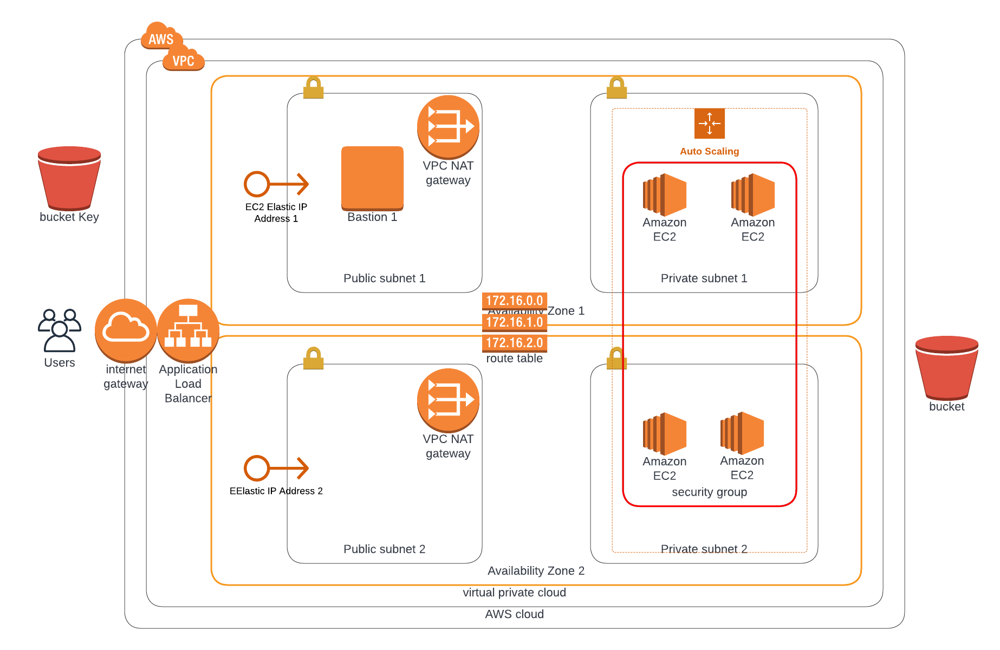
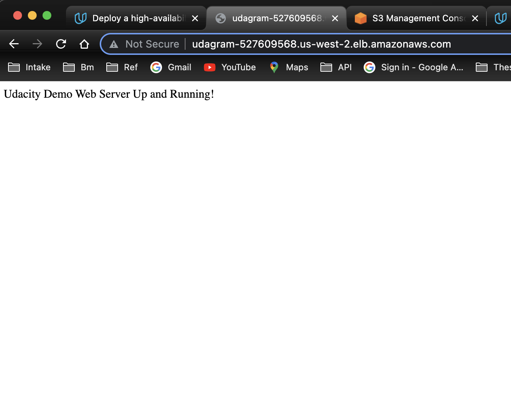

# Udacity Cloud DevOps Engineer Project-2 

#### Abebe Tedila abebetedila@gmail.com


## Deploy a High-Availability Web App using CloudFormation

### Architecture Diagram



#### Usage

It is tested for Ubuntu 22.04.


```
./create.sh (stackName) (script.yml) (parameters.json)
```

> Example:

```
./create.sh UdagramNet network.yaml network-parameters.json
```

It creates a CloudFormation stack named UdagramNet, with infrastructure described in .yaml and .json files, AWS-region is specified in the bash script.

#### Sequence
1. network.yml
2. bucket.yml
3. server.yml
4. waf.yml
5. iam.yml
6. sec-group.yamal

# Website Link :

[http://udagram-527609568.us-west-2.elb.amazonaws.com](http://udagram-527609568.us-west-2.elb.amazonaws.com/)


